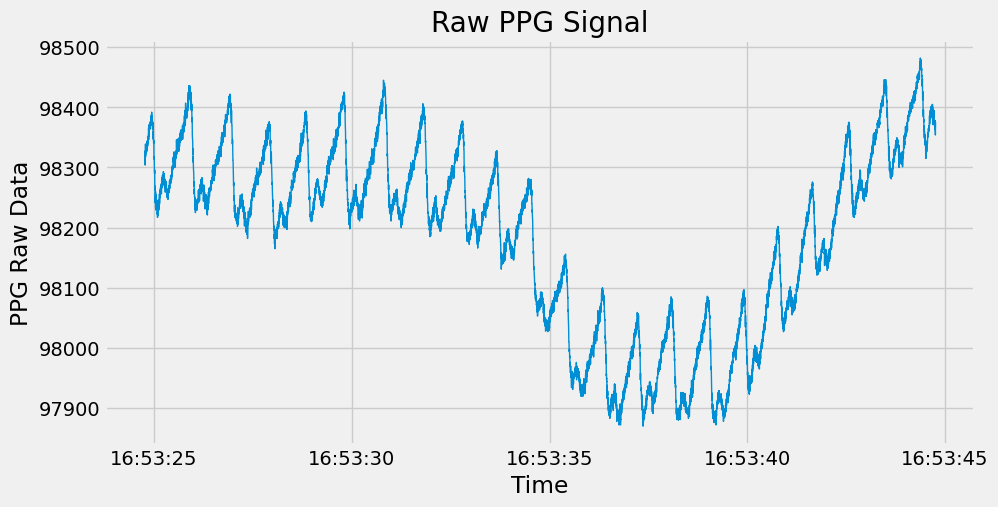
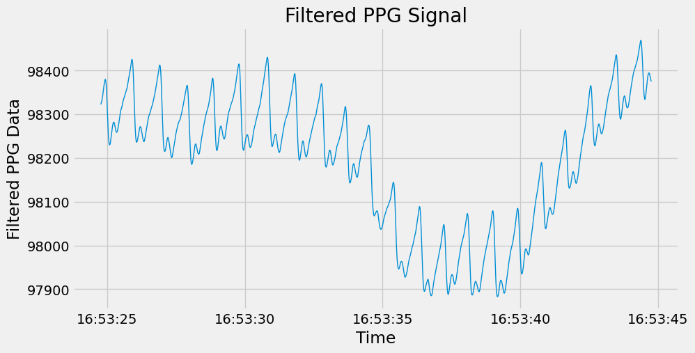
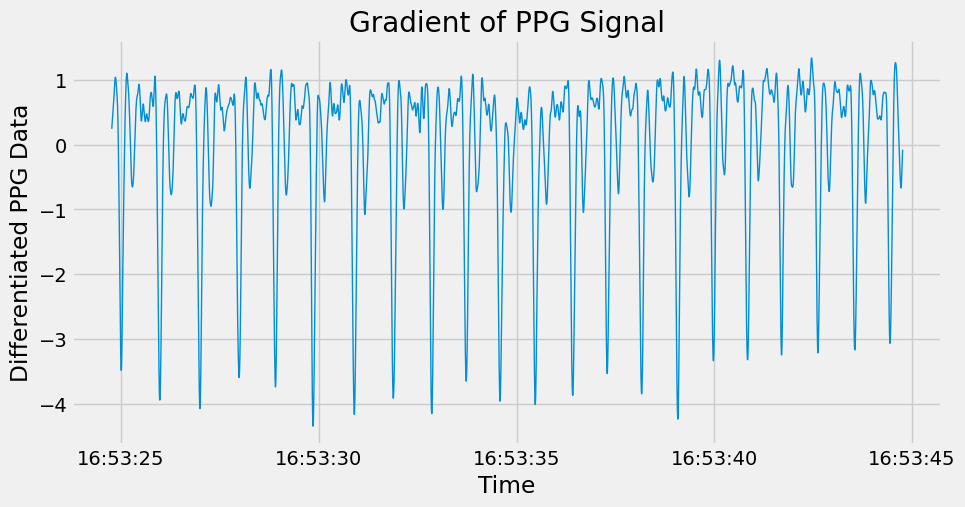
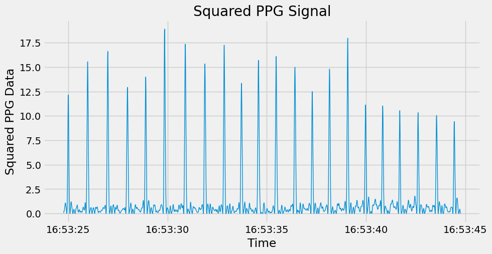
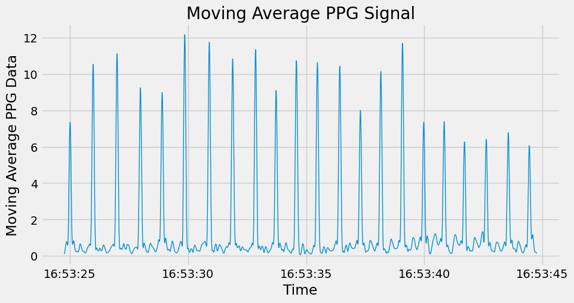

# Heart Rate Measurement

This Project focuses on Heart Rate Measurement algorithm from PPG Raw Data.

# PPG (Photoplethysmography):
Photoplethysmography (PPG) is a non-invasive method of measuring blood volume changes in tissues using light. It works by shining light into the skin and measuring the amount of light absorbed or reflected by the blood vessels. PPG can be used to measure heart rate, oxygen saturation, and blood pressure. It is commonly used in pulse oximeters, wearable fitness trackers, and other medical devices. PPG signals are typically acquired at a sampling frequency of 50-1000 Hz and can be analyzed using signal processing techniques such as filtering, peak detection, and frequency analysis. PPG is a simple and inexpensive method of monitoring cardiovascular health and has a wide range of applications in both clinical and non-clinical settings.


# Algorithm: 
Step0: Get Raw PPG signal </br>
Step1: Filter the PPG signal with a bandpass filter.</br>
Step2: Check signal quality by calculating Signal to Noise Ratio. </br>
Step3: Differentiate the filtered signal </br>
Step4: Square the differentiated  signal. </br>
Step5: Integrate the squared signal with a sliding window. </br>
Step6: Find the R-peaks in the integrated signal. </br>
Step7: Calculate the heart rate using the time difference between R-peaks. </br>

# How to Use:
- Create python environment using requirement.txt file. It includes all the libraries required for the project.</br>
- Project Structure:</br>
- Follow RawPPGDataAnalysis.ipynb for HeartRate Analysis Algorithm. This Jupyter nootbook provides all details of how algorithm works in detail.
- HeartRateDetectionScript.py is the python script to measure Heart Rate from multiple PPG Signal files. To measure copy multiple csv files from PPG_Dataset and paste into FileToBeMeasured folder and run the script. Script will process data file by file and print heart rate for each file on the terminal. Moreover you can also change channel used for analysis by changing channel variable.
```python
channel = 'pleth_2'
channel = 'pleth_5'
```
If you want to change number of samples(10000 By default) change below line
```python
ppg_data = df[['time', channel]].iloc[:10000]
```

# Results:
Following results are of s3_sit.csv on channel 'pleth_5'(infrared wavelength PPG from the proximal phalanx)
## 1. Raw PPG Signal


## 2. Filtered PPG Signal 


## 3. Gradient PPG Signal 


## 4. Squared PPG Signal 


## 5. Convolved(Moving Average) PPG Signal 


# Heart Breat Measured = 79.77 bpm